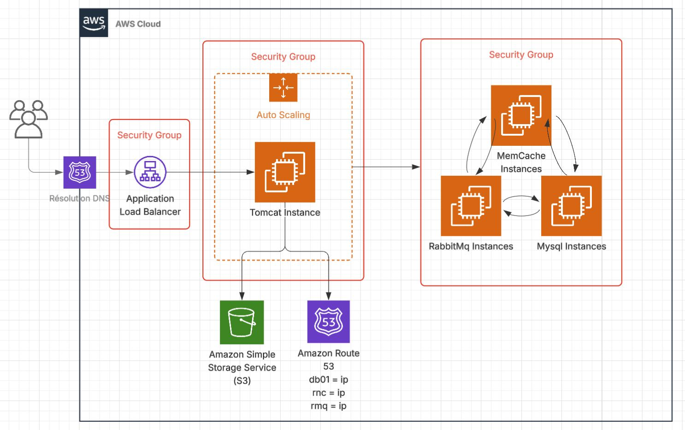

# AWS Lift and Shift Deployment - DevOps Portfolio Project

[](https://aws.amazon.com/)
[](https://aws.amazon.com/ec2/)
[](https://aws.amazon.com/route53/)
[](https://aws.amazon.com/s3/)
[](https://aws.amazon.com/elasticloadbalancing/)
[](https://www.gnu.org/software/bash/)

## 🎯 Project Overview

This project demonstrates the **Lift & Shift** strategy by deploying a **multi-tier Java web application stack (VProfile)** on **AWS Cloud**. It showcases my ability to design, automate, and manage **cloud-based infrastructure** using **AWS services** and **Infrastructure as Code (IaC)** practices.

### 🎓 Learning Context
*This project was completed as part of the "DevOps Beginners to Advanced with Projects" course by Imran Teli, serving as a cloud-focused hands-on demonstration of practical DevOps skills.*

## 🚀 Key Achievements

- ✅ **End-to-end cloud migration** of a multi-tier application  
- ✅ **Infrastructure automation** with EC2 user data & Bash scripting  
- ✅ **Highly available architecture** with ELB & Auto Scaling Groups  
- ✅ **Domain name integration** via Route 53 & GoDaddy DNS  
- ✅ **Secure HTTPS configuration** using AWS Certificate Manager  
- ✅ **Scalable & cost-effective infrastructure** with pay-as-you-go model  

## 🛠️ Technology Stack

| Category            | Technology/Service         | Purpose                         |
|---------------------|----------------------------|---------------------------------|
| **Compute**        | Amazon EC2                | Application & DB hosting       |
| **Networking**     | Security Groups, Route 53 | Access control & DNS           |
| **Storage**        | Amazon S3, EFS            | Artifact & shared storage      |
| **Load Balancing** | Elastic Load Balancer (ELB)| Traffic distribution          |
| **Scaling**        | Auto Scaling Groups       | Horizontal scaling             |
| **Security**       | AWS Certificate Manager    | SSL/TLS for HTTPS             |
| **Automation**     | Bash (User Data Scripts)   | Service provisioning          |

## 🎯 Project Objectives

Simulate a **cloud-based production environment** using AWS services for a multi-tier Java application stack.

This project demonstrates:
- ☁ **Cloud Infrastructure provisioning on AWS**
- 🔐 **Secure & Scalable Architecture**
- 🔧 **Automated EC2 provisioning & configuration**
- 🌐 **Custom DNS & HTTPS setup**
- 🚀 **Lift & Shift deployment strategy**

## 🏗️ Architecture Overview



### Infrastructure Components
- **Web/Application Layer**: EC2 Instances running Tomcat
- **Load Balancing Layer**: Application Load Balancer (HTTPS)
- **DNS Management**: Route 53 + GoDaddy domain mapping
- **Artifact Storage**: Amazon S3 (application builds)
- **Shared Storage**: Amazon EFS for distributed file system
- **Auto Scaling**: Automatically adjusts compute capacity
- **Security**: Security groups, ACM certificates

## ⚙️ Prerequisites

Make sure you have:
- **AWS Account with administrative access**
- **Configured AWS CLI** (with proper credentials)
- **Domain name registered** (e.g., via GoDaddy)
- **Git** installed for cloning the repository

## 🚀 Getting Started

1. **Login to AWS & create required resources:**

```bash
# Generate SSH key pair
aws ec2 create-key-pair --key-name vprofile-key --query 'KeyMaterial' --output text > vprofile-key.pem

# Create security groups, IAM roles, and other resources as needed
```

2. **Launch EC2 Instances with user data (Bash Scripts):**

```bash
aws ec2 run-instances   --image-id ami-xxxxxxx   --count 1   --instance-type t2.micro   --key-name vprofile-key   --security-group-ids sg-xxxxxx   --user-data file://userdata.sh
```

3. **Build and Upload Application to S3:**

```bash
mvn clean package
aws s3 cp target/vprofile.war s3://myapp-artifacts/
```

4. **Download and Deploy to Tomcat Instances:**

```bash
aws s3 cp s3://myapp-artifacts/vprofile.war /opt/tomcat/webapps/
```

5. **Setup Load Balancer & HTTPS:**
- Create an **Application Load Balancer (ALB)**
- Request SSL cert from **AWS Certificate Manager**
- Attach cert to ALB HTTPS listener

6. **Configure Route 53 & GoDaddy DNS:**
- Add CNAME or A-record in GoDaddy pointing to ALB DNS name

7. **Verify Application Access:**
```
https://www.myvprofileapp.com
```

8. **Create Auto Scaling Group for Tomcat Instances:**
- Define Launch Template with User Data
- Attach to ALB
- Configure scaling policies

## 📁 Project Structure

```
aws-lift-and-shift-deployment/
├── assets/
│   └── aws-architecture.png       # Architecture diagram
├── scripts/
│   ├── userdata.sh               # EC2 user data for Tomcat setup
│   ├── build.sh                  # Maven build & S3 upload
│   └── deploy.sh                 # Download & deploy WAR to Tomcat
├── pom.xml                       # Maven project descriptor
├── Jenkinsfile                   # Optional CI/CD pipeline definition
├── README.md
└── src/
    ├── main/
    │   ├── java/                 # Java source code
    │   ├── resources/            # Config files & SQL
    │   └── webapp/               # Web resources (JSP, static files)
    └── test/                     # Unit & integration tests
```

## 🧠 Why This Project?

This project highlights my skills in:
- **Cloud migration (Lift & Shift)**
- **AWS Infrastructure design & deployment**
- **Secure, scalable web hosting**
- **CI/CD-ready architecture**
- **Cost-effective DevOps practices**

It serves as a strong demonstration of my ability to build **real-world cloud-based solutions**.

## 🏁 Next Steps & Improvements

**Technical Enhancements:**
- Fully automate provisioning with **Terraform/CloudFormation**
- Integrate CI/CD with **Jenkins/GitHub Actions**
- Implement monitoring with **CloudWatch/Prometheus/Grafana**
- Containerize with **Docker** and orchestrate via **EKS/Kubernetes**
- Add **WAF** & **GuardDuty** for enhanced security

**Architecture Improvements:**
- Multi-AZ deployment for high availability
- Disaster recovery & backup strategies
- Implement blue/green deployment
- Enhance observability with distributed tracing

## 📝 Portfolio Note

This project is a **cloud migration & deployment exercise** designed to showcase **AWS proficiency** in a DevOps context. Based on the methodology from Imran Teli’s course, it demonstrates my ability to **architect, implement, and manage production-ready environments** in AWS.

**Skills Demonstrated:**
- AWS Cloud Architecture & Deployment
- Infrastructure as Code (IaC) principles
- Scalable & Secure System Design
- DevOps Automation Practices
- Cloud Networking & DNS Management
